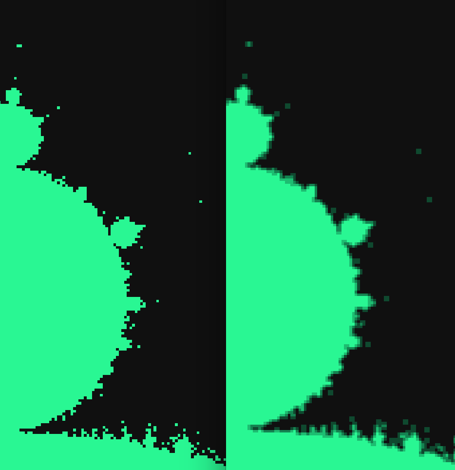

## Задание 3.6

Супервыборка - это способ уменьшить эффект пикселизации путём вычисления значений цвета
в нескольких точках в пределах каждого пикселя и их усреднения. ПРоще всего разделить
каждый пиксель на четыре "подпикселя". Реализуйте описанный метод

**Разница**

